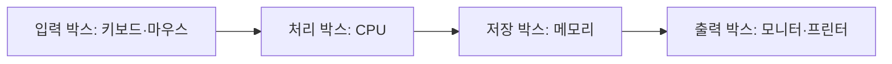
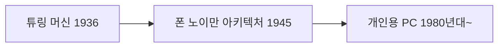

# Week 01 — 컴퓨터 원리와 Python 입문

## 주제
컴퓨터의 기본 동작 원리와 역사, 그리고 Python 기초 문법을 함께 학습한다.

---

## 비주얼 콘셉트

### 텍스트 흐름
- 입력 박스(키보드/마우스)
- 처리 박스(CPU)
- 저장 박스(메모리)
- 출력 박스(모니터/프린터)
- 한 칸 아래: 튜링 머신 → 폰 노이만 아키텍처 → 현대 PC 변천사

### 그림

---

## 학습 목표
- 컴퓨터의 4대 기능(입력/처리/저장/출력) 설명
- 컴퓨팅 역사 핵심 사건(튜링 머신, 폰 노이만 구조) 이해
- Python 기본 실행 구조와 print, 변수, 자료형 기초 학습

---

## 핵심 내용
1. 컴퓨터 역사 개요
   - 앨런 튜링과 계산 가능성
   - 폰 노이만 아키텍처(메모리 저장 프로그램)
   - 개인용 컴퓨터 → 인터넷 → 클라우드/AI 시대로 확장

2. 컴퓨터 동작 원리
   - 입력장치로 데이터 수집
   - CPU가 명령어를 해석/실행
   - 메모리/저장장치에 데이터 보관
   - 출력장치로 결과 전달

3. Python 시작하기
   - 인터프리터 언어 개념
   - `print()`로 실행 결과 확인
   - 변수와 자료형(str, int, float, list)

---

## 실습 미션
- 본인 이름, 나이, 관심 기술을 변수로 만들고 출력하기
- 입력/처리/출력 흐름을 본인 말로 5줄 요약하기

---

## 체크리스트
- [ ] 컴퓨터의 기본 동작 흐름을 설명할 수 있다
- [ ] 튜링 머신과 폰 노이만 구조를 구분할 수 있다
- [ ] Python에서 변수와 기본 자료형을 사용할 수 있다
