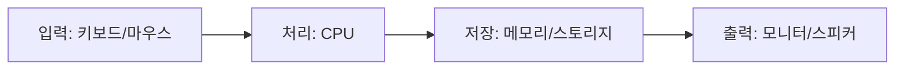
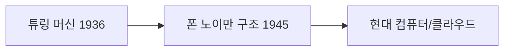

# Week 01 — 컴퓨터의 기본 원리와 Python 기초

## 학습 목표

이 학습을 통해 다음 내용을 이해할 수 있습니다.

- 컴퓨터의 **4대 기능(입력, 처리, 저장, 출력)**을 설명할 수 있다.
- **튜링 머신(Turing Machine)**과 **폰 노이만 구조(Von Neumann Architecture)**가 현대 컴퓨터 구조에 미친 영향을 이해할 수 있다.
- Python 실행 구조, 변수, 자료형, 조건문을 활용하여 간단한 프로그램을 작성할 수 있다.

---

## 1. 컴퓨터의 4대 기능

컴퓨터는 다양한 작업을 수행하지만, 기본적으로 다음 4가지 기능을 통해 동작합니다.

| 기능 | 설명 |
|---|---|
| 입력 (Input) | 사용자 또는 외부 장치로부터 데이터를 받는 과정 |
| 처리 (Processing) | 입력된 데이터를 계산하거나 논리적으로 처리 |
| 저장 (Storage) | 데이터를 기억하거나 보관 |
| 출력 (Output) | 처리된 결과를 사용자에게 보여주는 과정 |

### 1.1 입력 (Input)

입력은 컴퓨터가 외부에서 정보를 받아들이는 과정입니다.

**예시**
- 키보드로 글자를 입력
- 마우스로 클릭
- 카메라로 이미지 촬영
- 마이크로 음성 입력

**대표적인 입력 장치**
- Keyboard
- Mouse
- Scanner
- Camera
- Microphone

**예시 상황**

사용자가 키보드로 “Hello”를 입력하면 컴퓨터는 이를 데이터로 받아들입니다.

### 1.2 처리 (Processing)

처리는 입력된 데이터를 계산하거나 분석하는 과정입니다.

이 과정은 주로 CPU (Central Processing Unit)에서 수행됩니다.

**예시**
- 숫자 계산
- 문장 분석
- 이미지 처리
- 게임 그래픽 계산

**예시 상황**

`2 + 3`을 입력하면 컴퓨터는 계산하여 `5`라는 결과를 만들어냅니다.

### 1.3 저장 (Storage)

저장은 데이터를 보관하고 필요할 때 다시 사용할 수 있도록 하는 기능입니다.

**대표적인 저장 장치**
- RAM (임시 저장)
- SSD / HDD (영구 저장)
- USB
- Cloud Storage

**예시 상황**
- 문서 파일 저장
- 사진 저장
- 프로그램 설치

### 1.4 출력 (Output)

출력은 처리된 결과를 사용자에게 전달하는 과정입니다.

**대표적인 출력 장치**
- Monitor
- Printer
- Speaker
- Projector

**예시 상황**
- 계산 결과를 화면에 표시
- 문서를 프린터로 출력
- 음악을 스피커로 재생

### 1.5 4대 기능 전체 흐름

예시: 계산기 프로그램

1️⃣ 사용자가 숫자를 입력한다 → 입력  
2️⃣ 컴퓨터가 계산한다 → 처리  
3️⃣ 계산 결과를 메모리에 저장 → 저장  
4️⃣ 결과를 화면에 보여준다 → 출력

---

## 2. 튜링 머신 (Turing Machine)

튜링 머신은 **영국의 수학자 앨런 튜링(Alan Turing)**이 1936년에 제안한 이론적 계산 모델입니다.

현대 컴퓨터 과학의 기초 개념이 되었습니다.

### 튜링 머신의 구성

- 무한한 길이의 테이프 (데이터 저장)
- 읽기/쓰기 헤드
- 상태(State)
- 규칙(Algorithm)

### 작동 방식

1. 테이프에서 데이터를 읽는다.
2. 규칙에 따라 계산을 수행한다.
3. 결과를 테이프에 기록한다.
4. 다음 위치로 이동한다.

### 튜링 머신의 의미

튜링 머신은 다음 개념을 설명합니다.
- 알고리즘
- 계산 가능성
- 프로그램 실행

즉,  
“모든 계산 가능한 문제는 기계로 해결할 수 있다”는 개념을 제시했습니다.

### 현대 컴퓨터에 미친 영향

튜링 머신은 다음 개념의 기초가 되었습니다.
- 알고리즘
- 프로그램 실행
- 인공지능 연구
- 컴퓨터 과학

**예시**
- 검색 알고리즘
- 머신러닝 알고리즘
- 프로그래밍 언어

---

## 3. 폰 노이만 구조 (Von Neumann Architecture)

폰 노이만 구조는 현대 컴퓨터의 기본 구조입니다.

1945년 **존 폰 노이만(John Von Neumann)**이 제안했습니다.

### 폰 노이만 구조의 핵심 개념

컴퓨터는 다음 구성요소로 이루어집니다.
- CPU (중앙처리장치)
- Memory (메모리)
- Input Device (입력장치)
- Output Device (출력장치)

### Stored Program Concept

폰 노이만 구조의 가장 중요한 개념은 프로그램을 메모리에 저장한다는 것입니다.

- 이전 컴퓨터: 프로그램을 하드웨어로 구성
- 폰 노이만 구조: 프로그램을 소프트웨어로 저장

### 현대 컴퓨터에 미친 영향

현재 대부분의 컴퓨터는 폰 노이만 구조를 사용합니다.

**예시**
- PC
- 스마트폰
- 서버
- 슈퍼컴퓨터

---

## 4. 현대 컴퓨터의 특징

현대 컴퓨터는 다음 특징을 가지고 있습니다.

### 4.1 고속 처리

초당 수십억 번의 연산 수행

**예시**
- 게임 그래픽 처리
- AI 모델 계산

### 4.2 대용량 저장

테라바이트(TB) 단위 데이터 저장

**예시**
- 클라우드 저장
- 영상 데이터

### 4.3 네트워크 연결

인터넷을 통해 전 세계와 연결

**예시**
- 웹 서비스
- 클라우드 컴퓨팅

### 4.4 인공지능 활용

컴퓨터는 AI 기술을 활용하여 다양한 문제를 해결합니다.

**예시**
- 음성 인식
- 이미지 분석
- 자율주행

---

## 5. Python 기초

Python은 가장 많이 사용되는 프로그래밍 언어 중 하나입니다.

### 특징
- 배우기 쉬움
- 다양한 라이브러리
- 데이터 분석 및 AI에 강함

### 5.1 Python 실행 구조

Python 프로그램은 위에서 아래로 순서대로 실행됩니다.

```python
print("Hello")
print("Python")
```

**출력**
```text
Hello
Python
```

### 5.2 변수 (Variable)

변수는 데이터를 저장하는 공간입니다.

```python
name = "Tom"
age = 20
```

설명
- `name` → 문자열 저장
- `age` → 숫자 저장

### 5.3 Python 기본 자료형

| 자료형 | 설명 | 예시 |
|---|---|---|
| int | 정수 | 10 |
| float | 실수 | 3.14 |
| str | 문자열 | "Hello" |
| bool | 참/거짓 | True |

```python
age = 25
height = 175.5
name = "Alice"
is_student = True
```

### 5.4 조건문 (if / else)

조건문은 조건에 따라 다른 동작을 수행하는 구조입니다.

```python
age = 18

if age >= 18:
    print("성인입니다.")
else:
    print("미성년자입니다.")
```

### 5.5 반복문 (Loop)

반복문은 같은 작업을 여러 번 수행할 때 사용합니다.

```python
for i in range(5):
    print(i)
```

**출력**
```text
0
1
2
3
4
```

---

## 6. 간단한 Python 프로그램 예시

사용자의 나이를 입력받고 성인 여부를 판단하는 프로그램

```python
age = int(input("나이를 입력하세요: "))

if age >= 18:
    print("성인입니다.")
else:
    print("미성년자입니다.")
```

### 프로그램 흐름

1️⃣ 사용자 입력 → 입력 기능  
2️⃣ 나이 비교 → 처리 기능  
3️⃣ 변수 저장 → 저장 기능  
4️⃣ 결과 출력 → 출력 기능

---

## 비주얼 콘셉트
입력 장치 → CPU 처리 → 메모리 저장 → 출력 장치

튜링 머신 개념 → 폰 노이만 구조 → 현대 범용 컴퓨팅

### 그림




---

## 정리

이번 학습에서는 다음 내용을 배웠습니다.

- 컴퓨터의 기본 동작 원리인 입력, 처리, 저장, 출력
- 컴퓨터 과학의 기초 개념인 튜링 머신
- 현대 컴퓨터 구조의 기반인 폰 노이만 구조
- Python의 변수, 자료형, 조건문, 반복문

이 개념들은 컴퓨터 과학과 프로그래밍의 가장 기본적인 기초입니다.
