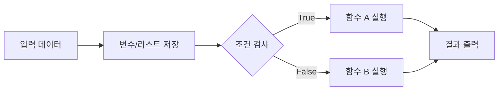

# Week 02 — Python 프로그래밍 기초

## 주제
Python의 기본 문법과 제어 구조를 사용해 간단한 프로그램을 작성한다.

---

## 학습 목표
- 변수와 자료형을 정확히 구분해 사용할 수 있다.
- 리스트를 사용해 여러 데이터를 저장하고 접근할 수 있다.
- 조건문과 함수를 이용해 재사용 가능한 로직을 만들 수 있다.

---

## 비주얼 콘셉트
### 텍스트 흐름
데이터 입력 → 변수 저장 → 조건 분기 → 함수 처리 → 결과 출력

### 그림


---

## 학습내용
- 변수는 값을 저장하는 이름이며, Python은 실행 시점에 타입을 결정한다.
- 리스트는 순서가 있는 컬렉션이며 인덱스는 0부터 시작한다.
- `if/else`로 흐름을 제어하고, `def`로 기능 단위를 분리한다.

```python
scores = [78, 92, 55]

def pass_or_fail(score: int) -> str:
    return "합격" if score >= 60 else "불합격"

for s in scores:
    print(s, pass_or_fail(s))
```

- 최신 Python 실무에서는 타입 힌트(`score: int`)를 함께 작성해 가독성과 유지보수성을 높인다.

---

## 핵심개념 정리
- 자료형: `str`, `int`, `float`, `list`
- 제어문: `if`, `elif`, `else`
- 함수: 입력(매개변수) → 처리 → 반환(`return`)

---

## 실습 미션
학생 이름과 점수를 받아 합격 여부를 출력하는 함수를 작성한다.

---

## 확장 실습
- 점수 유효범위(0~100) 검증 추가
- 여러 학생 데이터를 리스트/딕셔너리로 처리

---

## 체크리스트
- [ ] 변수와 자료형을 구분해 설명할 수 있다.
- [ ] 리스트 인덱싱을 사용할 수 있다.
- [ ] 조건문과 함수를 결합해 코드를 작성할 수 있다.
