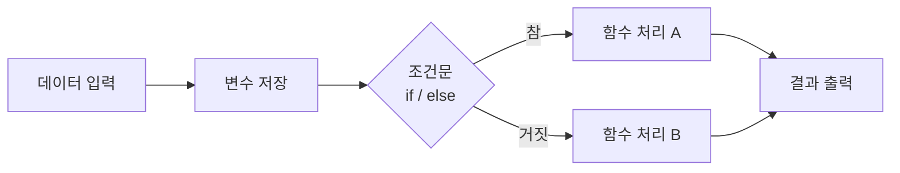

# Week 02 — Python 프로그래밍 기초

## 주제

Python 프로그래밍의 기본 개념을 이해하고  
변수, 자료형, 조건문, 함수 구조를 이용하여 간단한 프로그램을 작성할 수 있다.

---

## 비주얼 콘셉트

### 텍스트 흐름
데이터 입력 → 변수 저장 → 조건문 분기 → 함수 처리 → 결과 출력

### 그림


---

## 학습 목표

- Python 프로그램의 기본 실행 구조 이해
- 변수와 자료형 개념 이해
- 리스트와 데이터 구조 이해
- 조건문(if/else)을 이용한 프로그램 흐름 제어
- 함수(def)를 이용한 코드 재사용 개념 이해

---

## Python이란 무엇인가

Python은 배우기 쉽고 읽기 쉬운 프로그래밍 언어이다.

다음과 같은 분야에서 사용된다.

- 웹 개발
- 데이터 분석
- 인공지능
- 자동화 프로그램
- 서버 개발

Python이 널리 사용되는 이유는 다음과 같다.

- 문법이 간단하다
- 코드 가독성이 높다
- 다양한 라이브러리를 제공한다
- AI 개발에서 많이 사용된다

---

## Python 프로그램 실행 구조

Python 프로그램은 위에서 아래 순서로 실행된다.

```python
print("Hello")
print("Python")
```

실행 결과

```text
Hello
Python
```

Python은 명령어를 순차적으로 실행하는 인터프리터 언어이다.

---

## 변수 (Variable)

변수는 데이터를 저장하는 이름이 붙은 공간이다.

```python
name = "Tom"
score = 85
```

`=` 기호는 값을 저장(assign)하는 의미이다.

---

## 자료형 (Data Type)

| 자료형 | 설명 | 예 |
|---|---|---|
| str | 문자열 | "hello" |
| int | 정수 | 10 |
| float | 실수 | 3.14 |
| list | 여러 데이터 | [1,2,3] |

```python
name = "Alice"
age = 20
height = 165.5
numbers = [1,2,3]
```

---

## 리스트 (List)

리스트는 여러 데이터를 하나의 변수에 저장하는 자료형이다.

```python
fruits = ["apple", "banana", "orange"]
print(fruits[0])
```

결과

```text
apple
```

Python 리스트는 0번부터 시작한다.

---

## 조건문 (If Statement)

조건문은 특정 조건에 따라 다른 코드를 실행한다.

```python
score = 70

if score >= 60:
    print("합격")
else:
    print("불합격")
```

---

## 함수 (Function)

함수는 특정 기능을 수행하는 코드 묶음이다.

```python
def add(a, b):
    result = a + b
    return result

print(add(3, 5))
```

결과

```text
8
```

---

## Python 프로그램 예제

```python
name = "Tom"
score = 75

def pass_or_fail(score):
    if score >= 60:
        return "합격"
    return "불합격"

result = pass_or_fail(score)
print(name, result)
```

실행 결과

```text
Tom 합격
```

---

## 핵심 개념 정리

Python 프로그램은 다음 요소로 구성된다.

- 변수
- 자료형
- 조건문
- 함수

이 네 가지 개념을 이해하면 대부분의 프로그램 구조를 이해할 수 있다.

---

## 실습 미션

학생 이름과 점수를 입력받아 합격 여부를 출력하는 프로그램을 작성한다.

조건

- 합격 기준 점수 = 60
- 함수 사용
- 결과 출력

```python
name = "Tom"
score = 80

def check(score):
    if score >= 60:
        return "합격"
    return "불합격"

print(name, check(score))
```

---

## 확장 실습

- 합격 기준 점수를 변수로 만들기
- 점수가 0~100 범위를 벗어나면 오류 메시지 출력
- 여러 학생 점수를 리스트로 관리하기

---

## 체크리스트

- [ ] 변수 개념을 설명할 수 있다
- [ ] 자료형 종류를 설명할 수 있다
- [ ] 조건문을 사용할 수 있다
- [ ] 함수를 정의하고 사용할 수 있다
- [ ] 간단한 Python 프로그램을 작성할 수 있다
