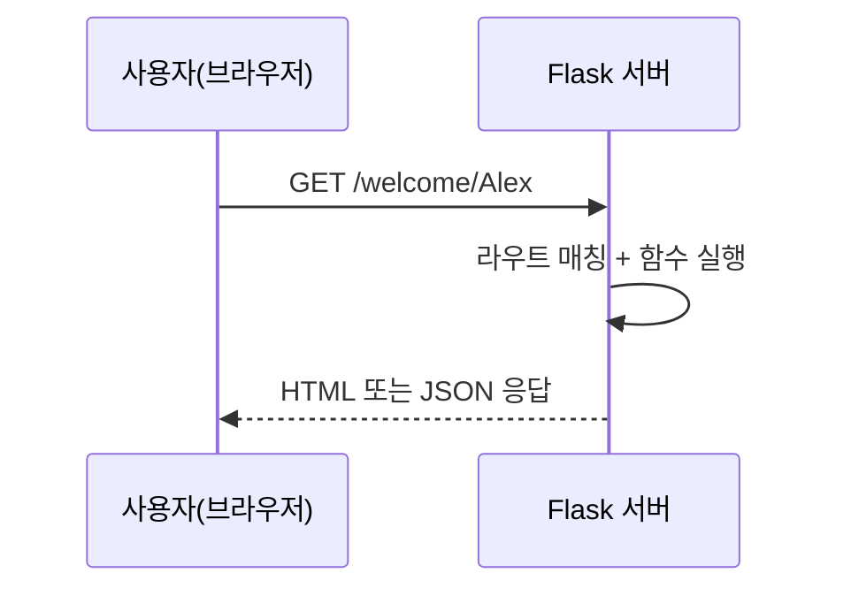

# Week 03 — Flask 서버 기초

## 주제
웹의 요청/응답 구조를 이해하고 Flask로 간단한 서버를 만든다.

---

## 비주얼 콘셉트

### 텍스트 흐름
브라우저 요청(Request) → Flask 라우팅 → 서버 로직 처리 → HTML/JSON 응답(Response)

### 그림


---

## 학습 목표
- HTTP 기본 메서드(GET/POST) 이해
- Flask 기본 구조와 라우팅 구성
- URL 파라미터로 사용자 입력 처리
- `index.html`을 Flask에서 렌더링하는 방법 이해

---

## 핵심 코드
```python
from flask import Flask, render_template

app = Flask(__name__)

@app.route('/')
def home():
    return render_template('index.html')
```

---

## 실습 미션
- `/welcome/<name>` 라우트를 추가해 환영 메시지 반환
- `/about` 페이지를 만들고 강의 소개 텍스트 표시
