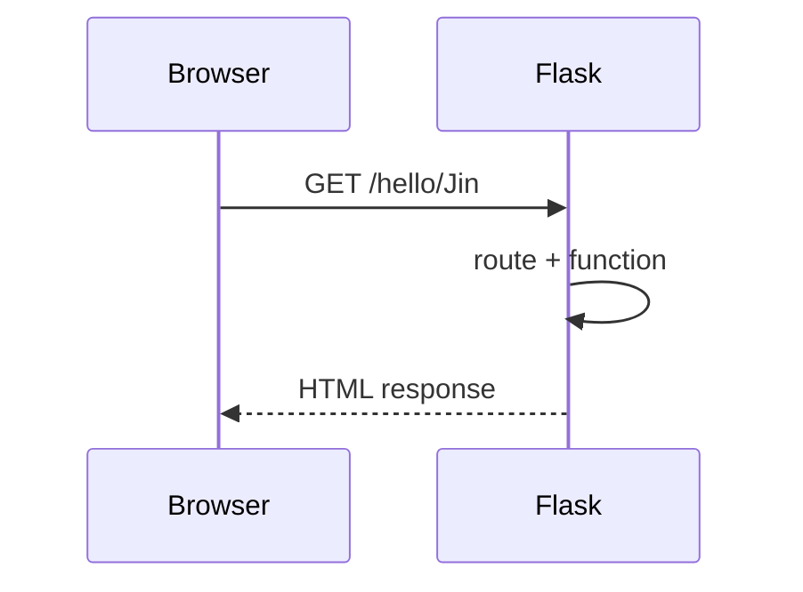

# Week 03 — Flask 서버 기초

## 주제
HTTP 요청/응답 구조를 이해하고 Flask로 기본 웹 서버를 구현한다.

---

## 학습 목표
- GET/POST 요청의 차이를 설명할 수 있다.
- Flask 라우팅을 구성하고 URL 파라미터를 처리할 수 있다.
- 템플릿 렌더링으로 동적 페이지를 출력할 수 있다.

---

## 비주얼 콘셉트
### 텍스트 흐름
브라우저 요청 → Flask 라우트 매칭 → 서버 로직 실행 → HTML/JSON 응답

### 그림


---

## 학습내용
- HTTP는 클라이언트 요청과 서버 응답으로 동작한다.
- Flask의 `@app.route()`는 URL과 Python 함수를 연결한다.
- `render_template()`를 사용하면 데이터를 HTML에 주입할 수 있다.

```python
from flask import Flask, render_template

app = Flask(__name__)

@app.route('/hello/<name>')
def hello(name):
    return render_template('hello.html', name=name)
```

- 최신 웹 백엔드에서는 API(JSON)와 SSR(서버 템플릿)을 상황에 맞게 혼합해 사용한다.

---

## 핵심개념 정리
- HTTP 메서드: GET, POST
- Flask 라우팅: URL ↔ 함수
- 템플릿 렌더링: 서버 데이터 기반 HTML 생성

---

## 실습 미션
`/greet/<name>` 경로를 만들고 이름을 받아 환영 문장을 출력한다.

---

## 확장 실습
- POST 폼 처리 추가
- JSON 응답 API(`jsonify`) 엔드포인트 구현

---

## 체크리스트
- [ ] Flask 앱 실행 구조를 설명할 수 있다.
- [ ] URL 파라미터를 처리할 수 있다.
- [ ] 템플릿 렌더링을 사용할 수 있다.
