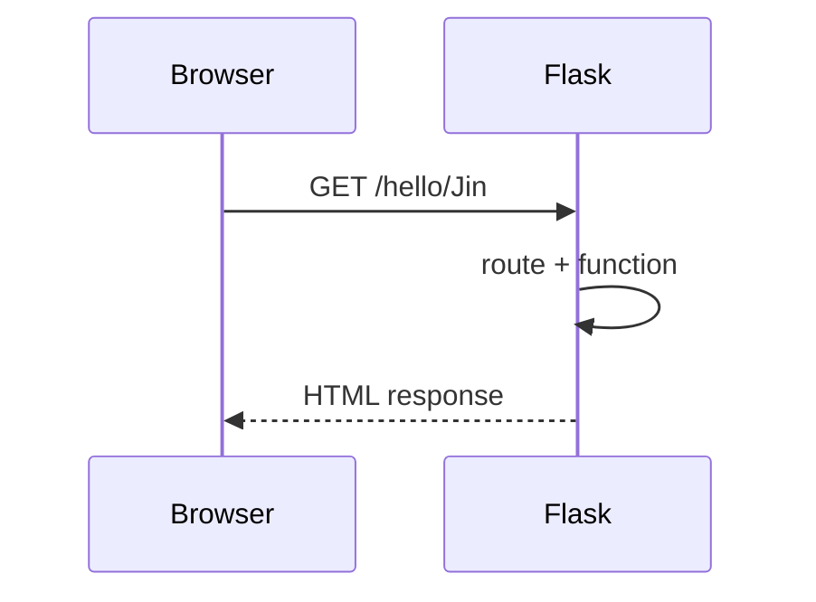

# Week 03 — Flask 서버 기초

## 주제
HTTP 요청/응답 구조를 이해하고 Flask로 기본 웹 서버를 구현한다.

---

## 학습 목표
- GET/POST 요청의 차이를 설명할 수 있다.
- Flask 라우팅을 구성하고 URL 파라미터를 처리할 수 있다.
- 템플릿 렌더링으로 동적 페이지를 출력할 수 있다.

---

## 학습 내용 (목표 연계)
- **GET/POST 차이**: GET은 조회 중심, POST는 데이터 생성/전송 중심이라는 목적 차이를 실제 URL/폼 예제로 구분한다.
- **라우팅과 URL 파라미터**: Flask의 `@app.route()`로 경로를 함수에 연결하고, `<name>` 같은 파라미터를 받아 동적으로 응답을 만든다.
- **템플릿 렌더링**: `render_template()`로 서버 데이터를 HTML에 전달해 사용자마다 다른 화면을 만들 수 있다.
- **초급자 포인트**: 서버 실행 후 브라우저에서 주소를 바꿔보며 어떤 함수가 실행되는지 직접 추적해본다.

---

## 비주얼 콘셉트
브라우저 요청 → Flask 라우트 매칭 → 서버 로직 실행 → HTML/JSON 응답

### 그림


---

## 학습 예시 및 코드
- HTTP는 클라이언트 요청과 서버 응답으로 동작한다.
- Flask의 `@app.route()`는 URL과 Python 함수를 연결한다.
- `render_template()`를 사용하면 데이터를 HTML에 주입할 수 있다.

```python
from flask import Flask, render_template

app = Flask(__name__)

@app.route('/hello/<name>')
def hello(name):
    return render_template('hello.html', name=name)
```

- 최신 웹 백엔드에서는 API(JSON)와 SSR(서버 템플릿)을 상황에 맞게 혼합해 사용한다.

---

## 핵심개념 정리
- HTTP 메서드: GET, POST
- Flask 라우팅: URL ↔ 함수
- 템플릿 렌더링: 서버 데이터 기반 HTML 생성

---

## 실습 미션
1. 이번 주 학습 목표 3가지를 확인하고, 각 목표를 검증할 수 있는 실습 항목을 최소 1개씩 수행한다.
2. 실습 과정(입력값, 코드/설정, 실행 결과)을 문서나 노트에 정리한다.
3. 어려웠던 점 1가지와 다음 주에 개선할 점 1가지를 작성한다.

---

## 확장 실습
- POST 폼 처리 추가
- JSON 응답 API(`jsonify`) 엔드포인트 구현

---

## 체크리스트
- [ ] Flask 앱 실행 구조를 설명할 수 있다.
- [ ] URL 파라미터를 처리할 수 있다.
- [ ] 템플릿 렌더링을 사용할 수 있다.
