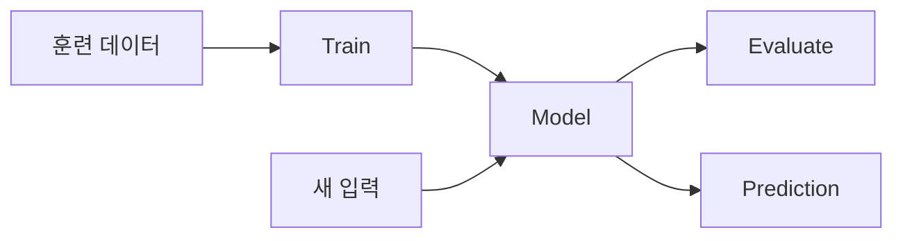

# Week 04 — Machine Learning 기초

## 주제
지도학습의 핵심인 분류/회귀 개념과 기본 모델 학습 과정을 익힌다.

---

## 학습 목표
- 전통 규칙 기반 프로그래밍과 머신러닝의 차이를 설명할 수 있다.
- 분류 문제와 회귀 문제를 구분할 수 있다.
- scikit-learn으로 간단한 모델을 학습/예측할 수 있다.

---

## 비주얼 콘셉트
### 텍스트 흐름
데이터 준비(X, y) → 모델 학습 → 평가 → 새 데이터 예측

### 그림


---

## 학습내용
- 머신러닝은 데이터에서 패턴을 학습해 예측한다.
- 분류는 범주 예측, 회귀는 연속값 예측이다.
- 기본 워크플로우: 데이터 분할 → 학습 → 평가(`accuracy`, `MAE`) → 개선.

```python
from sklearn.model_selection import train_test_split
from sklearn.linear_model import LinearRegression

X = [[1], [2], [3], [4], [5]]
y = [55, 63, 71, 80, 88]
X_train, X_test, y_train, y_test = train_test_split(X, y, test_size=0.2, random_state=42)
model = LinearRegression().fit(X_train, y_train)
print(model.predict([[6]]))
```

- 최신 실무에서는 데이터 누수 방지와 재현성 확보(random seed, 버전 고정)가 중요하다.

---

## 핵심개념 정리
- 문제 정의: 분류 vs 회귀
- 학습 파이프라인: split → train → evaluate
- 일반화: 학습 데이터 밖에서도 성능 유지

---

## 실습 미션
공부시간-점수 데이터를 이용해 회귀 모델을 만들고 예측값을 확인한다.

---

## 확장 실습
- `RandomForestClassifier`로 간단한 분류 문제 실습
- 교차검증(`cross_val_score`) 적용

---

## 체크리스트
- [ ] 분류와 회귀 차이를 설명할 수 있다.
- [ ] scikit-learn 기본 학습 코드를 작성할 수 있다.
- [ ] 예측 결과를 해석할 수 있다.
