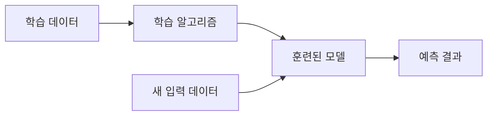

# Week 04 — Machine Learning 기초

## 주제
머신러닝의 기본 개념(지도학습/분류/회귀)과 대표 알고리즘을 이해한다.

---

## 비주얼 콘셉트

### 텍스트 흐름
학습 데이터(X, y) → 알고리즘 학습(분류/회귀) → 모델 생성 → 새 데이터 예측

### 그림

---

## 학습 목표
- 전통 프로그래밍 vs 머신러닝 차이 설명
- 분류와 회귀 문제 구분
- Decision Tree, Random Forest 직관 이해

---

## 핵심 내용
- 지도학습: 입력과 정답(label)으로 규칙 학습
- 분류: 스팸/정상 메일, 고양이/강아지
- 회귀: 집값, 매출, 점수 예측

---

## 실습 미션
`scikit-learn`의 `LinearRegression`으로 공부시간-점수 예측 모델 만들기.
