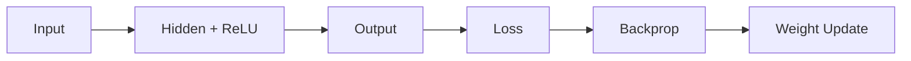

# Week 05 — Neural Network 기초

## 주제
퍼셉트론부터 다층 신경망, 활성화 함수, 역전파까지 신경망의 기본 원리를 이해한다.

---

## 학습 목표
- 퍼셉트론과 다층 신경망 구조를 설명할 수 있다.
- ReLU, Sigmoid, Softmax의 역할을 구분할 수 있다.
- 손실 함수와 역전파의 관계를 설명할 수 있다.

---

## 학습 내용 (목표 연계)
- **퍼셉트론과 다층 신경망**: 퍼셉트론은 한 번의 선형 결합으로 판단하고, 다층 구조는 더 복잡한 패턴을 학습할 수 있다.
- **활성화 함수 역할**: ReLU는 학습 효율, Sigmoid는 확률 해석, Softmax는 다중 분류 확률 출력에 주로 사용된다.
- **손실 함수와 역전파**: 예측과 정답의 차이(손실)를 줄이기 위해 기울기를 계산해 가중치를 업데이트한다.
- **초급자 포인트**: ‘예측→오차계산→가중치수정’ 반복이 학습의 핵심 루프라는 점을 기억한다.

---

## 비주얼 콘셉트
입력층 → 은닉층(활성화) → 출력층 → 손실 계산 → 역전파 업데이트

### 그림


---

## 학습 예시 및 코드
- 퍼셉트론은 입력의 가중합과 활성화 함수로 출력을 만든다.
- 다층 신경망은 비선형 표현을 학습해 복잡한 패턴을 처리한다.
- 역전파는 손실을 줄이는 방향으로 가중치를 갱신한다.

```python
from sklearn.neural_network import MLPClassifier

X = [[0,0],[0,1],[1,0],[1,1]]
y = [0,1,1,0]
clf = MLPClassifier(hidden_layer_sizes=(8,), max_iter=2000, random_state=42)
clf.fit(X, y)
print(clf.predict([[1, 0]]))
```

- 최신 딥러닝에서는 Adam 옵티마이저, 학습률 스케줄링, 정규화가 기본 설정으로 널리 쓰인다.

---

## 핵심개념 정리
- 뉴런 계산: 가중합 + 활성화
- 학습: 손실 최소화
- 역전파: 기울기 기반 파라미터 업데이트

---

## 실습 미션
1. 이번 주 학습 목표 3가지를 확인하고, 각 목표를 검증할 수 있는 실습 항목을 최소 1개씩 수행한다.
2. 실습 과정(입력값, 코드/설정, 실행 결과)을 문서나 노트에 정리한다.
3. 어려웠던 점 1가지와 다음 주에 개선할 점 1가지를 작성한다.

---

## 확장 실습
- 은닉층 크기/학습률 변경 후 성능 비교
- 과적합 방지를 위한 검증셋 분리

---

## 체크리스트
- [ ] 퍼셉트론과 다층 구조 차이를 설명할 수 있다.
- [ ] 활성화 함수 역할을 구분할 수 있다.
- [ ] 역전파 개념을 설명할 수 있다.
