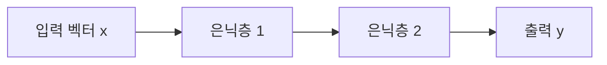

# Week 05 — 딥러닝의 이해: 인공신경망(ANN)과 학습 메커니즘

## 학습 목표
- 인공신경망의 구조(입력층/은닉층/출력층)를 설명한다.
- 순전파와 역전파의 원리를 이해한다.
- 활성화 함수와 옵티마이저의 역할을 구분한다.

---

## 1. 딥러닝이란?
딥러닝은 여러 은닉층(Deep)을 가진 신경망으로 특징을 자동 추출하는 학습 방법.

## 2. 신경망 기본 구조

## 3. 핵심 수식 개념
- 선형 결합: `z = Wx + b`
- 활성화: `a = f(z)`
- 손실: 예측과 정답의 차이
- 역전파: 체인룰로 각 가중치의 기울기 계산

## 4. 활성화 함수
- ReLU: 빠르고 단순, 가장 널리 사용
- Sigmoid: 확률 해석 가능, 깊은 층에서 gradient 문제 가능
- Tanh: 0 중심, 여전히 gradient 소실 가능

## 5. 옵티마이저
- SGD: 기본 경사하강법
- Momentum: 관성 추가
- Adam: 적응형 학습률(실무에서 자주 사용)

## 실습 미션
1. MLP로 숫자 분류(MNIST) 학습.
2. ReLU vs Sigmoid 성능 비교.
3. learning rate를 바꿔 수렴 속도 분석.

## 정리
딥러닝의 본질은 "미분 가능한 함수 근사 + 역전파 기반 최적화"이다.

