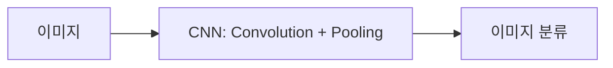
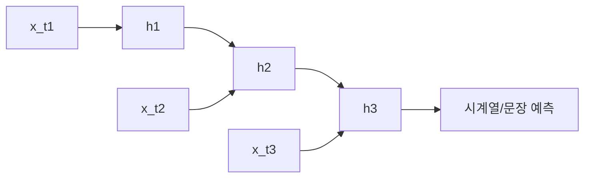

# Week 06 — CNN & RNN 기초

## 주제
이미지 처리(CNN)와 순차 데이터 처리(RNN/LSTM)의 차이를 이해한다.

---

## 비주얼 콘셉트

### 텍스트 흐름
- 이미지 데이터: 합성곱(CNN) → 특징맵 → 분류
- 순차 데이터: 시간순 입력(RNN/LSTM) → 상태 전달 → 다음 값 예측

### 그림

---

## 학습 목표
- CNN의 Convolution/Pooling 원리 이해
- RNN의 순차 처리 구조 이해
- LSTM이 필요한 이유 파악

---

## 실습 미션
CNN 모델 요약 출력, RNN 예제 입력 형태 비교 정리.
