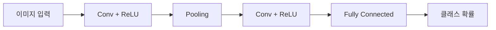

# Week 06 — CNN: 이미지 인식 혁신 모델의 원리

## 학습 목표
- CNN이 왜 이미지 처리에 강한지 설명한다.
- 컨볼루션, 풀링, 필터의 역할을 이해한다.
- 대표 CNN 계열(LeNet, AlexNet, ResNet) 흐름을 파악한다.

---

## 1. CNN이 필요한 이유
일반 신경망은 이미지 픽셀 수가 늘면 파라미터가 폭증한다.
CNN은 지역 수용영역(local receptive field)과 가중치 공유로 효율을 높인다.

## 2. CNN 구성 요소
- Convolution Layer: 특징 추출(에지, 텍스처, 패턴)
- Activation(ReLU): 비선형성 부여
- Pooling: 공간 크기 축소, 과적합 완화
- Fully Connected: 최종 분류

## 3. 대표 모델 발전
- LeNet: 초기 CNN 구조
- AlexNet: GPU 기반 대규모 학습의 시작
- VGG: 단순하고 깊은 구조
- ResNet: 잔차 연결로 깊은 네트워크 학습 안정화

## 실습 미션
1. CIFAR-10 이미지 분류 모델 학습.
2. 필터 시각화로 학습된 특징 관찰.
3. 데이터 증강 전/후 성능 비교.

## 정리
CNN은 "공간 구조를 보존한 특징 추출"로 컴퓨터 비전 성능을 크게 끌어올렸다.

