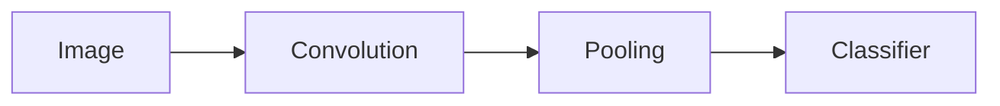
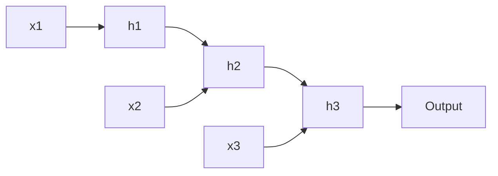

# Week 06 — CNN & RNN 기초

## 주제
CNN과 RNN/LSTM의 처리 대상과 동작 차이를 이해하고 대표 사용 사례를 학습한다.

---

## 학습 목표
- CNN의 Convolution/Pooling 동작을 설명할 수 있다.
- RNN의 순차 처리 구조와 한계를 설명할 수 있다.
- LSTM이 왜 필요한지 설명할 수 있다.

---

## 학습 내용 (목표 연계)
- **CNN 동작 이해**: Convolution은 이미지의 지역 특징을 찾고, Pooling은 중요한 정보를 압축해 계산량을 줄인다.
- **RNN 구조와 한계**: 순서 정보를 반영할 수 있지만, 문장이 길어질수록 앞 정보를 잊는 문제가 생길 수 있다.
- **LSTM 필요성**: 게이트 구조로 중요한 정보를 오래 유지해 장기 의존성 문제를 완화한다.
- **초급자 포인트**: 데이터 형태가 모델 선택의 출발점이다. 이미지는 CNN 계열, 시퀀스는 RNN/LSTM/Transformer를 먼저 고려한다.

---

## 비주얼 콘셉트
이미지: 합성곱 → 특징맵 → 분류

시퀀스: 입력 시점 t1→t2→t3 → 상태 전달 → 출력

### 그림




---

## 학습 예시 및 코드
- CNN은 지역 패턴(엣지/텍스처)을 계층적으로 학습해 이미지 인식에 강하다.
- RNN은 이전 상태를 다음 계산에 전달해 문장/시계열을 처리한다.
- LSTM/GRU는 장기 의존성 문제를 완화해 긴 문맥 처리 성능을 높인다.

```python
# 개념 예시 (Keras)
# model = Sequential([
#   Conv2D(32, 3, activation='relu'), MaxPooling2D(),
#   Flatten(), Dense(10, activation='softmax')
# ])
```

- 최신 실무에서는 이미지는 CNN 백본+Transformer, 텍스트는 Transformer 기반 모델 사용이 일반적이다.

---

## 핵심개념 정리
- CNN: 공간 특징 추출
- RNN/LSTM: 시간 순서 정보 반영
- 모델 선택은 데이터 형태(이미지/시계열/텍스트)에 따라 결정

---

## 실습 미션
1. 이번 주 학습 목표 3가지를 확인하고, 각 목표를 검증할 수 있는 실습 항목을 최소 1개씩 수행한다.
2. 실습 과정(입력값, 코드/설정, 실행 결과)을 문서나 노트에 정리한다.
3. 어려웠던 점 1가지와 다음 주에 개선할 점 1가지를 작성한다.

---

## 확장 실습
- MNIST CNN 베이스라인 학습
- 간단한 시계열 데이터에 LSTM 적용

---

## 체크리스트
- [ ] CNN과 RNN의 차이를 설명할 수 있다.
- [ ] LSTM의 필요성을 설명할 수 있다.
- [ ] 데이터 유형에 맞는 모델을 고를 수 있다.
