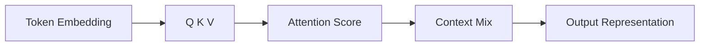

# Week 07 — Transformer 기초

## 주제
Self-Attention을 중심으로 Transformer 구조와 장점을 이해한다.

---

## 학습 목표
- Q/K/V와 Self-Attention 계산 흐름을 설명할 수 있다.
- Multi-Head Attention의 필요성을 설명할 수 있다.
- RNN 대비 Transformer의 장점을 설명할 수 있다.

---

## 비주얼 콘셉트
### 텍스트 흐름
토큰 임베딩 → Q/K/V 생성 → Attention 가중합 → 문맥 반영 표현

### 그림


---

## 학습내용
- Self-Attention은 각 토큰이 다른 토큰을 얼마나 참고할지 가중치를 계산한다.
- Multi-Head는 서로 다른 관점의 관계를 병렬로 학습한다.
- Transformer는 병렬 처리에 유리해 대규모 학습과 긴 문맥 처리에서 강점을 보인다.

```python
# 개념 수식
# Attention(Q, K, V) = softmax(QK^T / sqrt(d_k)) V
```

- 최신 LLM은 대부분 Transformer 계열이며, 긴 컨텍스트/효율화를 위한 변형(예: GQA, MoE)이 활발히 쓰인다.

---

## 핵심개념 정리
- Attention: 중요도 기반 정보 결합
- Multi-Head: 다양한 관계 학습
- Transformer: 병렬성 + 확장성

---

## 실습 미션
짧은 문장을 예시로 들어 특정 단어가 어떤 단어를 주로 참조하는지 설명한다.

---

## 확장 실습
- Positional Encoding 필요성 정리
- Encoder-only / Decoder-only 구조 비교

---

## 체크리스트
- [ ] Q/K/V 개념을 설명할 수 있다.
- [ ] Multi-Head Attention 이유를 설명할 수 있다.
- [ ] Transformer 장점을 말할 수 있다.
