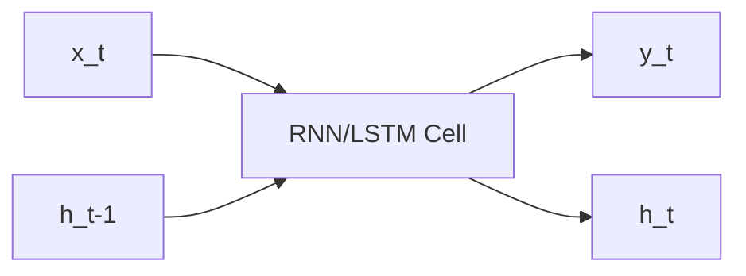

# Week 07 — RNN, LSTM, GRU: 시퀀스 학습의 원리

## 학습 목표
- 순차 데이터(텍스트, 시계열)의 특성을 이해한다.
- RNN의 순환 구조와 한계를 설명한다.
- LSTM/GRU가 gradient 소실 문제를 어떻게 개선하는지 이해한다.

---

## 1. 시퀀스 데이터란?
시간/순서가 중요한 데이터.
- 문장: 앞 단어가 뒤 단어 의미에 영향
- 주가/센서: 과거 시점이 미래 예측에 영향

## 2. RNN 기본 원리
현재 입력과 이전 은닉상태를 함께 사용해 다음 상태를 계산.

`h_t = f(x_t, h_{t-1})`

## 3. RNN 한계
- 긴 문맥에서 정보 유지 어려움
- 기울기 소실/폭주 문제

## 4. LSTM과 GRU
- LSTM: 입력/망각/출력 게이트 + 셀 상태로 장기 의존성 개선
- GRU: 구조 단순화로 계산 효율 향상

## 실습 미션
1. 간단한 문장 감성 분류(RNN/LSTM 비교).
2. 시계열 예측에서 window 크기 변경 실험.
3. LSTM과 GRU의 학습 시간/성능 비교.

## 정리
RNN 계열은 LLM 이전 자연어처리의 핵심 기반을 제공했다.

