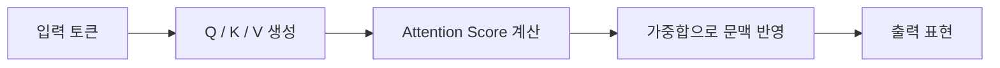

# Week 07 — Transformer 기초

## 주제
Self-Attention 중심으로 Transformer의 핵심 개념을 학습한다.

---

## 비주얼 콘셉트

### 텍스트 흐름
입력 토큰 → Q/K/V 생성 → Self-Attention 점수 계산 → 문맥 반영 표현 출력

### 그림

---

## 학습 목표
- Self-Attention, Q/K/V 개념 이해
- Multi-Head Attention 이유 설명
- RNN 대비 Transformer 장점 이해

---

## 실습 미션
짧은 문장에서 어떤 단어가 어떤 단어에 주목하는지 사례 설명.
