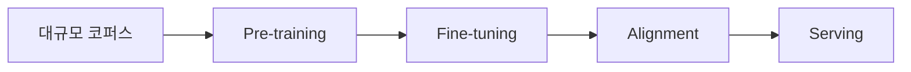

# Week 08 — LLM의 탄생 (GPT & Gemini)

## 주제
사전학습, 미세조정, 정렬 과정을 통해 LLM이 어떻게 만들어지는지 이해한다.

---

## 학습 목표
- Pre-training과 Fine-tuning의 목적 차이를 설명할 수 있다.
- RLHF/정렬의 필요성과 한계를 설명할 수 있다.
- 서비스 요구사항에 맞춰 모델 선택 기준을 세울 수 있다.

---

## 비주얼 콘셉트
### 텍스트 흐름
대규모 사전학습 → 작업별 미세조정 → 정렬(RLHF/RLAIF) → 운영 배포

### 그림


---

## 학습내용
- Pre-training은 광범위한 언어 패턴을 학습하고, Fine-tuning은 특정 작업 성능을 개선한다.
- 정렬 단계는 유해성 감소, 지시 준수, 품질 일관성 확보를 목표로 한다.
- 모델 선택 시 품질, 지연시간, 비용, 컨텍스트 길이, 안전 정책을 함께 검토해야 한다.

```text
모델 선택 예시 기준
1) 응답 품질(정확성/추론)
2) 비용(입출력 토큰 단가)
3) 지연시간(P95)
4) 안전/규정 준수
```

- 최신 트렌드는 SFT + 선호학습(DPO 등), 경량 모델의 온디바이스 활용 확대다.

---

## 핵심개념 정리
- Pre-training: 범용 지식 습득
- Fine-tuning: 도메인 적응
- Alignment: 사용자 의도와 안전성 정렬

---

## 실습 미션
하나의 서비스 시나리오를 정하고 적합한 모델 계열을 선정해 근거를 작성한다.

---

## 확장 실습
- 프롬프트 기반 개선 vs 파인튜닝 적용 기준 비교
- 폐쇄형 API와 오픈모델 배포 방식 비교

---

## 체크리스트
- [ ] Pre-training/Fine-tuning 차이를 설명할 수 있다.
- [ ] 정렬 단계의 목적을 설명할 수 있다.
- [ ] 모델 선택 기준표를 만들 수 있다.
