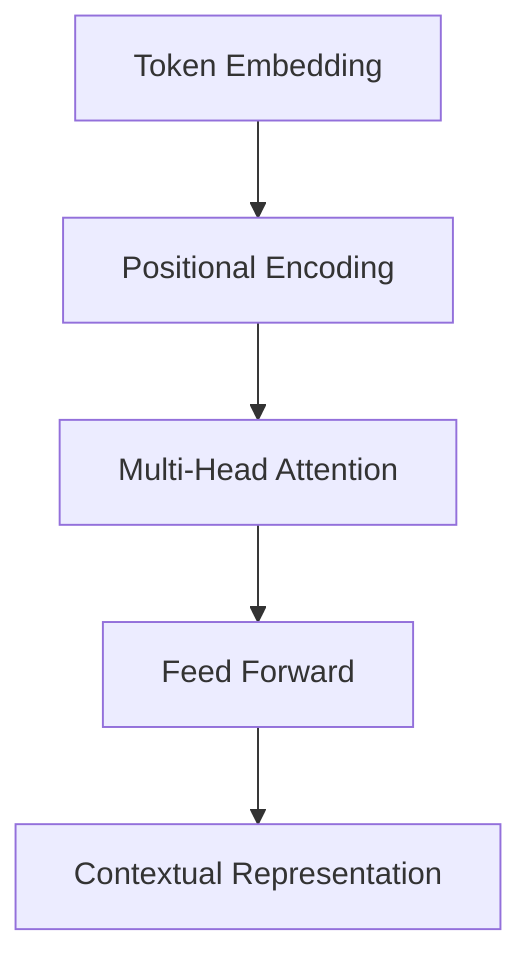

# Week 08 — Transformer: 현대 AI의 핵심 전환점

## 학습 목표
- Transformer의 Self-Attention 원리를 설명한다.
- RNN 대비 병렬 처리 장점을 이해한다.
- 인코더/디코더 구조와 포지셔널 인코딩의 역할을 파악한다.

---

## 1. 왜 Transformer가 등장했나?
RNN은 순차 계산이라 느리고 긴 문맥 학습이 어렵다.
Transformer는 Attention으로 토큰 간 관계를 직접 계산해 해결했다.

## 2. Self-Attention 핵심
입력 토큰마다 Query(Q), Key(K), Value(V)를 만들고,
Q와 K 유사도로 가중치를 계산해 V를 가중합한다.

## 3. 구조
- Multi-Head Attention: 다양한 관점의 관계 학습
- Feed Forward Network
- Residual + LayerNorm
- Positional Encoding: 순서 정보 주입

## 4. 의의
Transformer는 BERT, GPT, T5 등 대형 언어모델의 공통 기반이다.

## 실습 미션
1. 짧은 문장에서 attention score 시각화.
2. positional encoding 유무 성능 비교.
3. 번역 태스크에서 seq2seq와 Transformer 비교.

## 정리
Transformer는 LLM 시대를 연 핵심 아키텍처다.

