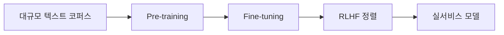

# Week 08 — LLM의 탄생 (GPT & Gemini)

## 주제
사전학습·미세조정·RLHF를 중심으로 LLM 개발 과정을 이해한다.

---

## 비주얼 콘셉트

### 텍스트 흐름
대규모 사전학습(Pre-training) → 작업별 미세조정(Fine-tuning) → RLHF 정렬 → 서비스 배포

### 그림

---

## 학습 목표
- Pre-training / Fine-tuning 차이 설명
- RLHF 개념과 목적 이해
- 모델 선택 시 비용/속도/품질 기준 정리

---

## 실습 미션
서비스 시나리오를 정하고 적합한 LLM 계열 선정 근거 작성.
