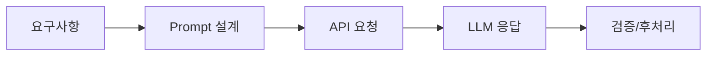

# Week 09 — API 활용과 프롬프트 엔지니어링

## 주제
LLM API 호출 구조와 프롬프트 설계 방법을 통해 응답 품질을 개선한다.

---

## 학습 목표
- API 요청/응답(JSON) 구조를 읽고 작성할 수 있다.
- 시스템/사용자 프롬프트 역할을 구분할 수 있다.
- 제약조건, 예시, 출력 형식을 포함한 프롬프트를 설계할 수 있다.

---

## 학습 내용 (목표 연계)
- **JSON 요청 구조**: `model`, `messages`, `temperature` 등 핵심 필드를 이해하고 요청 본문을 직접 구성한다.
- **프롬프트 역할 분리**: 시스템 프롬프트는 규칙, 사용자 프롬프트는 과업 지시를 담당한다.
- **출력 형식 고정**: JSON 형식/키 이름을 지정하면 후처리 안정성이 높아진다.
- **초급자 포인트**: 같은 질문도 프롬프트 구조에 따라 품질이 크게 달라지므로 버전별 비교 기록이 중요하다.

---

## 비주얼 콘셉트
요구사항 정의 → 프롬프트 설계 → API 호출 → 결과 검증/개선

### 그림


---

## 학습 예시 및 코드
- API 호출 시 모델명, 메시지 배열, 파라미터(temperature, max_tokens)를 명시한다.
- 시스템 프롬프트는 전역 규칙, 사용자 프롬프트는 작업 요구를 전달한다.
- 구조화 출력(JSON schema, 키 고정) 요구를 주면 후처리가 안정적이다.

```python
payload = {
  "model": "gpt-4.1-mini",
  "messages": [
    {"role": "system", "content": "항상 JSON으로 답하라"},
    {"role": "user", "content": "3문장 요약"}
  ]
}
```

- 최신 운영에서는 프롬프트 버전관리, 자동 평가셋 회귀 테스트를 함께 적용한다.

---

## 핵심개념 정리
- API 구조: request → response
- 프롬프트 분리: system / user / assistant
- 품질 개선: 제약 명시 + 평가 루프

---

## 실습 미션
1. 이번 주 학습 목표 3가지를 확인하고, 각 목표를 검증할 수 있는 실습 항목을 최소 1개씩 수행한다.
2. 실습 과정(입력값, 코드/설정, 실행 결과)을 문서나 노트에 정리한다.
3. 어려웠던 점 1가지와 다음 주에 개선할 점 1가지를 작성한다.

---

## 확장 실습
- 함수호출(Function Calling) 형태로 출력 강제
- 실패 케이스 수집 후 프롬프트 수정

---

## 체크리스트
- [ ] JSON 요청 구조를 작성할 수 있다.
- [ ] 시스템/사용자 프롬프트를 구분할 수 있다.
- [ ] 개선된 프롬프트를 설계할 수 있다.
