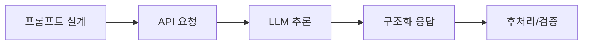

# Week 09 — API 활용과 프롬프트 엔지니어링

## 주제
LLM API 호출과 프롬프트 설계 기법을 익혀 응답 품질을 개선한다.

---

## 비주얼 콘셉트

### 텍스트 흐름
프롬프트 설계 → API 요청(JSON) → LLM 추론 → 구조화 응답 → 후처리/검증

### 그림

---

## 학습 목표
- API 요청/응답(JSON) 구조 이해
- 시스템/사용자 프롬프트 역할 구분
- 제약조건, 예시 기반 프롬프트 설계

---

## 실습 미션
동일 작업을 기본 프롬프트 vs 개선 프롬프트로 비교 테스트.
