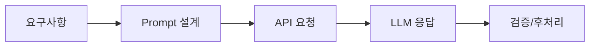

# Week 09 — API 활용과 프롬프트 엔지니어링

## 주제
LLM API 호출 구조와 프롬프트 설계 방법을 통해 응답 품질을 개선한다.

---

## 학습 목표
- API 요청/응답(JSON) 구조를 읽고 작성할 수 있다.
- 시스템/사용자 프롬프트 역할을 구분할 수 있다.
- 제약조건, 예시, 출력 형식을 포함한 프롬프트를 설계할 수 있다.

---

## 비주얼 콘셉트
### 텍스트 흐름
요구사항 정의 → 프롬프트 설계 → API 호출 → 결과 검증/개선

### 그림


---

## 학습내용
- API 호출 시 모델명, 메시지 배열, 파라미터(temperature, max_tokens)를 명시한다.
- 시스템 프롬프트는 전역 규칙, 사용자 프롬프트는 작업 요구를 전달한다.
- 구조화 출력(JSON schema, 키 고정) 요구를 주면 후처리가 안정적이다.

```python
payload = {
  "model": "gpt-4.1-mini",
  "messages": [
    {"role": "system", "content": "항상 JSON으로 답하라"},
    {"role": "user", "content": "3문장 요약"}
  ]
}
```

- 최신 운영에서는 프롬프트 버전관리, 자동 평가셋 회귀 테스트를 함께 적용한다.

---

## 핵심개념 정리
- API 구조: request → response
- 프롬프트 분리: system / user / assistant
- 품질 개선: 제약 명시 + 평가 루프

---

## 실습 미션
같은 작업에 대해 기본 프롬프트와 개선 프롬프트를 설계하고 결과를 비교한다.

---

## 확장 실습
- 함수호출(Function Calling) 형태로 출력 강제
- 실패 케이스 수집 후 프롬프트 수정

---

## 체크리스트
- [ ] JSON 요청 구조를 작성할 수 있다.
- [ ] 시스템/사용자 프롬프트를 구분할 수 있다.
- [ ] 개선된 프롬프트를 설계할 수 있다.
