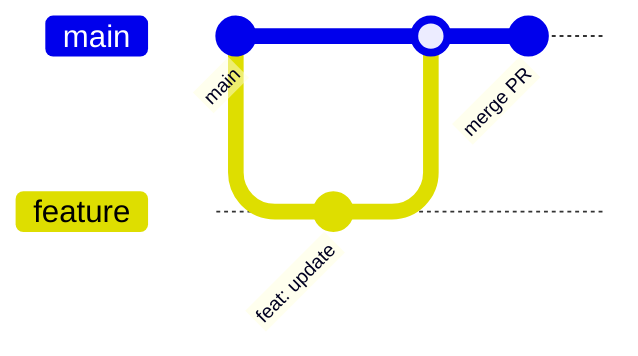

# Week 10 — GitHub, 코드의 타임머신

## 주제
Git/GitHub 기반 협업과 버전 관리 흐름을 실습 중심으로 익힌다.

---

## 학습 목표
- add/commit/push/pull 명령을 정확히 사용할 수 있다.
- 브랜치-PR 기반 협업 흐름을 설명할 수 있다.
- 충돌(conflict) 발생 시 기본 해결 절차를 수행할 수 있다.

---

## 비주얼 콘셉트
### 텍스트 흐름
브랜치 생성 → 기능 커밋 → 원격 푸시 → PR 생성/리뷰 → 머지

### 그림


---

## 학습내용
- Git은 로컬 히스토리 관리 도구, GitHub는 원격 협업 플랫폼이다.
- 실무 기본 루프는 `branch -> commit -> push -> PR -> review -> merge`다.
- 커밋 메시지는 변경 의도를 명확히 기록해야 추적이 쉽다.

```bash
git checkout -b feature/login-ui
git add .
git commit -m "feat: 로그인 UI 문구 수정"
git push -u origin feature/login-ui
```

- 최신 협업에서는 보호 브랜치, CI 검사, 코드오너 리뷰를 기본 정책으로 둔다.

---

## 핵심개념 정리
- 버전 관리: 변경 이력 추적
- 브랜치 전략: main 보호 + 기능 분기
- PR: 코드 리뷰와 품질 게이트

---

## 실습 미션
브랜치를 생성해 파일 수정 후 PR 설명(변경점/테스트/영향범위)을 작성한다.

---

## 확장 실습
- 의도적으로 충돌을 만들고 수동 해결
- Conventional Commits 형식 적용

---

## 체크리스트
- [ ] 핵심 Git 명령을 사용할 수 있다.
- [ ] PR 기반 협업 흐름을 설명할 수 있다.
- [ ] 충돌 해결 절차를 실행할 수 있다.
