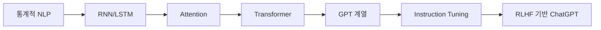

# Week 10 — ChatGPT를 성장시킨 핵심 모델 계보 정리

## 학습 목표
- ChatGPT 발전에 기여한 모델 흐름을 이해한다.
- RNN/CNN/Transformer/Instruction Tuning/RLHF의 연결성을 설명한다.
- 모델 선택 기준(성능, 비용, 지연시간, 안전성)을 정리한다.

---

## 1. 발전 계보

## 2. 모델별 이론/원리 요약
| 모델 | 핵심 원리 | 장점 | 한계 |
|---|---|---|---|
| RNN/LSTM | 순차 은닉상태 전파 | 시계열/문장 처리 가능 | 병렬화 어려움 |
| CNN | 합성곱 필터로 특징 추출 | 이미지 처리 강점 | 장거리 의존성 약함 |
| Transformer | Self-Attention | 병렬학습, 긴 문맥 | 계산량 큼 |
| GPT | 자기회귀 생성 | 자연스러운 텍스트 생성 | 환각 가능 |
| RLHF | 사람 선호 보상학습 | 사용자 친화 응답 | 보상 설계 난도 |

## 3. 실무 적용 체크리스트
- 정확도 vs 속도
- API 비용 vs 자체 호스팅
- 개인정보/보안 정책
- 평가 지표(정확도 + 사용자 만족도)

## 실습 미션
1. 사용 시나리오별 모델 선택표 작성.
2. 동일 기능을 소형/대형 모델로 비용 비교.
3. 안전 필터 정책 초안 작성.

## 정리
ChatGPT의 발전은 단일 모델이 아니라 여러 이론과 학습 전략이 누적된 결과다.

