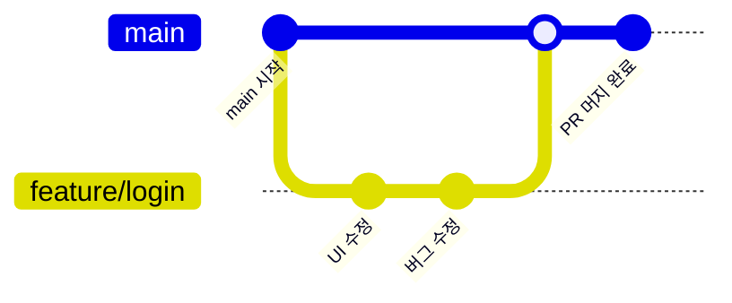

# Week 10 — GitHub, 코드의 타임머신

## 주제
Git/GitHub 협업과 버전 관리 기본기를 실습한다.

---

## 비주얼 콘셉트

### 텍스트 흐름
main 브랜치에서 분기 → 기능 커밋 누적 → Pull Request 생성 → 코드 리뷰 후 병합

### 그림

---

## 학습 목표
- `add/commit/push/pull` 명령어 숙달
- 브랜치 전략과 PR 리뷰 흐름 이해
- 충돌 해결 기본 절차 학습

---

## 실습 미션
브랜치 생성 후 `index.html` 수정 → PR 설명 작성까지 수행.
