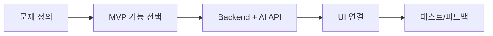

# Week 11 — AI 서비스 구현 (MVP)

## 주제
Flask 백엔드와 AI API를 통합해 실제 동작하는 MVP를 구현한다.

---

## 학습 목표
- MVP 기능 우선순위를 정하고 범위를 제한할 수 있다.
- AI API 연동 시 오류 처리/재시도/로그를 설계할 수 있다.
- API 키와 사용자 데이터 보안 기본 원칙을 적용할 수 있다.

---

## 비주얼 콘셉트
### 텍스트 흐름
문제 정의 → 최소 기능 설계 → API 연동 구현 → 테스트/피드백 → 개선

### 그림


---

## 학습내용
- MVP는 "핵심 가치 검증"에 필요한 최소 기능만 구현한다.
- API 연동 시 timeout, 예외 응답, rate limit에 대응해야 한다.
- 비밀키는 `.env` 환경변수로 관리하고 저장소에 커밋하지 않는다.

```python
import os
api_key = os.getenv("OPENAI_API_KEY")
if not api_key:
    raise RuntimeError("API key is missing")
```

- 최신 서비스 개발에서는 관측성(로그/메트릭)과 사용자 피드백 루프가 초기 품질을 좌우한다.

---

## 핵심개념 정리
- MVP: 핵심 기능 우선
- 안정성: 오류 처리 + 재시도
- 보안: 키 관리 + 입력 검증

---

## 실습 미션
질문-답변 챗 MVP를 구현하고 에러 상황(키 없음/타임아웃) 처리 메시지를 추가한다.

---

## 확장 실습
- 간단한 사용량 로깅 대시보드 추가
- 사용자 세션별 대화 이력 저장

---

## 체크리스트
- [ ] MVP 범위를 정의할 수 있다.
- [ ] API 오류 처리를 구현할 수 있다.
- [ ] 키 보안 원칙을 적용할 수 있다.
