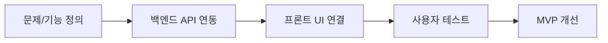

# Week 11 — AI 서비스 구현 (MVP)

## 주제
Flask와 AI API를 결합해 동작하는 최소기능제품(MVP)을 완성한다.

---

## 비주얼 콘셉트

### 텍스트 흐름
문제 정의 → Flask 백엔드 + AI API 연동 → 프론트 UI 연결 → 사용자 피드백으로 MVP 개선

### 그림

---

## 학습 목표
- 기능 우선순위(MVP) 정의
- 백엔드 API 연동과 오류 처리
- 키 보안 및 로그 관리 기초

---

## 실습 미션
질문-답변이 동작하는 챗 인터페이스 구현 후 데모.
