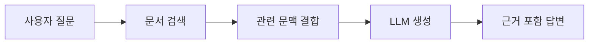

# Week 11 — AI 서비스 구현: 프롬프트 엔지니어링과 RAG 기초

## 학습 목표
- 프롬프트 설계 원칙을 이해한다.
- RAG(Retrieval-Augmented Generation) 구조를 설명한다.
- 간단한 챗봇 파이프라인을 구성한다.

---

## 1. 프롬프트 엔지니어링 원칙
- 역할(Role) 지정
- 목표(Task) 명확화
- 출력 형식(Format) 고정
- 제약 조건(톤, 길이, 금지사항) 명시

## 2. RAG 원리
LLM 외부 지식 베이스를 검색해 근거 기반 응답을 생성.

## 3. 구성 요소
- 임베딩 모델
- 벡터 DB(FAISS, Chroma 등)
- 검색기(Retriever)
- 생성기(LLM)

## 4. 평가
- 정답성(accuracy)
- 근거성(groundedness)
- 응답 시간(latency)

## 실습 미션
1. 강의 노트 기반 Q&A 챗봇 구현.
2. 검색 k값 변경에 따른 품질 비교.
3. 근거 문서 citation 포함 출력.

## 정리
실서비스 품질을 높이려면 LLM 단독보다 RAG와 평가 파이프라인이 중요하다.

