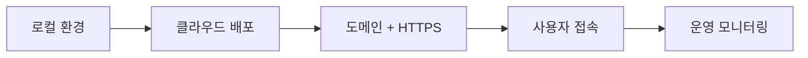

# Week 12 — 클라우드 배포와 최종 발표

## 주제
완성한 AI 서비스를 클라우드에 배포하고 최종 발표를 진행한다.

---

## 비주얼 콘셉트

### 텍스트 흐름
로컬 개발 완료 → 클라우드 배포 → 도메인/HTTPS 연결 → 사용자 접속 및 운영 모니터링

### 그림

---

## 학습 목표
- 배포 체크리스트(의존성/환경변수/포트/로그) 점검
- 도메인·HTTPS·운영 안정성 기초 이해
- 프로젝트 발표 스토리라인 완성

---

## 실습 미션
배포 URL, GitHub 저장소, 발표자료를 정리해 데모데이 발표.
