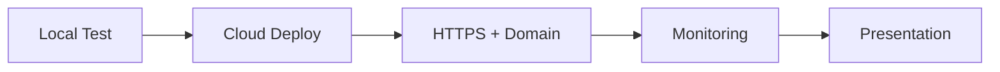

# Week 12 — 클라우드 배포와 최종 발표

## 주제
완성한 AI 서비스를 클라우드에 배포하고 운영/발표까지 마무리한다.

---

## 학습 목표
- 배포 전 체크리스트(의존성/환경변수/포트/헬스체크)를 점검할 수 있다.
- 도메인, HTTPS, 기본 운영 모니터링의 필요성을 설명할 수 있다.
- 문제-해결-성과 중심의 최종 발표 스토리라인을 구성할 수 있다.

---

## 학습 내용 (목표 연계)
- **배포 전 점검**: 의존성 버전, 환경변수, 실행 포트, 헬스체크를 확인해 배포 실패를 줄인다.
- **운영 요소 이해**: 도메인/HTTPS/로그 모니터링은 서비스 신뢰성과 보안의 기본 구성요소다.
- **발표 스토리라인 구성**: 문제 정의 → 해결 방법 → 결과/한계 → 다음 계획 순서로 전달하면 이해가 쉽다.
- **초급자 포인트**: 기술 설명보다 ‘사용자에게 어떤 변화가 있었는지’를 중심으로 발표하면 설득력이 높다.

---

## 비주얼 콘셉트
로컬 검증 → 클라우드 배포 → 도메인/HTTPS 설정 → 모니터링 → 발표

### 그림


---

## 학습 예시 및 코드
- 배포는 코드 실행뿐 아니라 환경변수, 로그, 장애 대응까지 포함한다.
- HTTPS 적용과 최소한의 접근 제어는 기본 보안 요구사항이다.
- 발표는 기술 나열보다 사용자 문제와 개선 결과를 중심으로 구성해야 설득력이 높다.

```text
발표 템플릿
1) 어떤 문제를 해결했는가
2) 왜 이 기능을 MVP로 선택했는가
3) 데모 결과와 한계
4) 다음 개선 계획
```

- 최신 운영 실무에서는 배포 자동화(CI/CD)와 에러 트래킹 도구를 함께 사용한다.

---

## 핵심개념 정리
- 배포 품질: 재현성 + 안정성
- 운영 기본: HTTPS, 로그, 모니터링
- 발표 핵심: 문제 정의와 임팩트 전달

---

## 실습 미션
1. 이번 주 학습 목표 3가지를 확인하고, 각 목표를 검증할 수 있는 실습 항목을 최소 1개씩 수행한다.
2. 실습 과정(입력값, 코드/설정, 실행 결과)을 문서나 노트에 정리한다.
3. 어려웠던 점 1가지와 다음 주에 개선할 점 1가지를 작성한다.

---

## 확장 실습
- 배포 파이프라인 자동화(GitHub Actions)
- 장애 시나리오(서버 다운/키 만료) 대응 문서 작성

---

## 체크리스트
- [ ] 배포 체크리스트를 점검했다.
- [ ] HTTPS/도메인 구성을 설명할 수 있다.
- [ ] 최종 발표 스토리라인을 완성했다.
